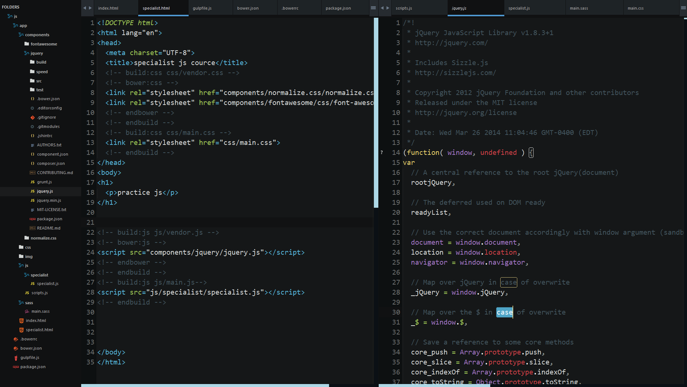

## Sublime 3 for web development

<i>Sublime workspace</i>

  

### Install package
- [AdvancedNewFile](https://github.com/skuroda/Sublime-AdvancedNewFile) - Advanced file creation
- [Alignment](https://packagecontrol.io/packages/Alignment) - A simple key-binding for aligning multi-line and multiple selections
- [Apply​Syntax](https://packagecontrol.io/packages/ApplySyntax) - Syntax detector
- [Auto​File​Name](https://packagecontrol.io/packages/AutoFileName) - plugin that autocompletes filenames 
- [Bracket​Highlighter](https://packagecontrol.io/packages/BracketHighlighter) - Bracket and tag highlighter
- [Buffer​Scroll](https://packagecontrol.io/packages/BufferScroll) - Remember, restore and sync scroll, bookmarks, marks, folds and cursors
- [Color Highlighter](https://packagecontrol.io/packages/Color%20Highlighter) - plugin, which underlays selected hexadecimal colorcodes (like "#FFFFFF", "rgb(255,255,255)", "white", etc.) with their real color
- [Diffy](https://packagecontrol.io/packages/Diffy) - plugin to show difference between 2 files
- [Emmet](https://packagecontrol.io/packages/Emmet) - Emmet (ex-Zen Coding)
- [Gist](https://packagecontrol.io/packages/Gist) - plugin for creating new Gists from selected text
- [Goto-CSS-Declaration](https://packagecontrol.io/packages/Goto-CSS-Declaration) - Goto CSS declaration in an open *.css file
- [Live​Reload](https://packagecontrol.io/packages/LiveReload) - LiveReload plugin
- [Future Funk - Color Scheme](https://packagecontrol.io/packages/Future%20Funk%20-%20Color%20Scheme) - An easy to read dark color scheme
- [Seti_UI](https://packagecontrol.io/packages/Seti_UI) - Theme & ColorScheme
- [Seti_UX](https://packagecontrol.io/packages/Seti_UX) - Seti Improved Scheme/Syntax-HL
- [Themr](https://packagecontrol.io/packages/Themr) - A UI theme selector for Sublime Text.
- [Side​Bar​Enhancements](https://packagecontrol.io/packages/SideBarEnhancements) - Enhancements to Sublime Text sidebar. Files and folders.
- [Syntax Highlighting for Sass](https://packagecontrol.io/packages/Syntax%20Highlighting%20for%20Sass) - Perfect syntax highlighting for both SCSS and Sass.

