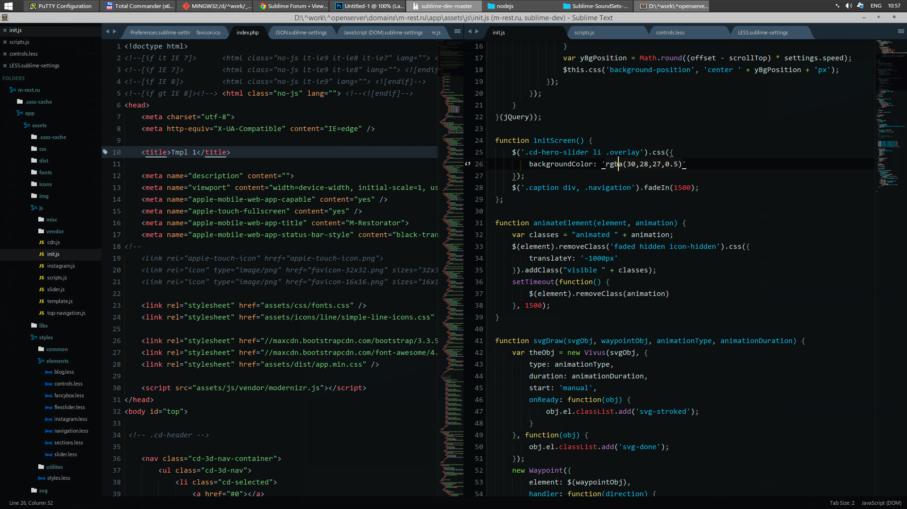

## Sublime 3 Front End Build

Наш билд Sublime Text 3 для фронт-энда, с небольшой оглядкой на фул-стак.

### Кастомные цветовые схемы

	Две основные цветовые схемы: твикнутые версии Seti UI и One Dark, кастомизируемые под определенный тип данных.

	Назначать кастомные схемы типам данных можно через меню <b>Preferences -> Settings - More --> Syntax Specific</b>.

	<p align="center">
	
	</p>

### Для работы SublimeLinter

Для отлова ошибок надо установить пару node модулей:

```
npm install -g csslint
npm install -g jshint
```

В файле Preferences.sublime-settings указать пути к node

```json
"sublimelinter_executable_map":
{
    "javascript":"C:\\Program Files\\nodejs\\node.exe",
    "jslint":"C:\\Program Files\\nodejs\\node.exe",
    "css":"C:\\Program Files\\nodejs\\node.exe"
}
```

### Хоткеи
* 1. [Хоткеи специфические](Build/hot-keys.pdf)
* 2. [Справочник по всем](Build/sublime_text_keyboard_shortcuts.pdf)


